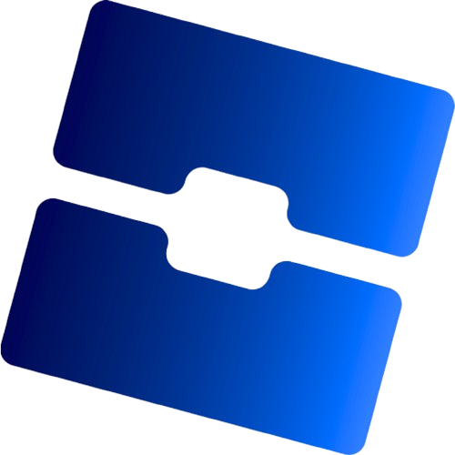

# RobloxID-Finder
Find any Roblox user's **User ID** instantly by just typing their username.
This project is under the MIT Licence: feel free to use our software and edit it.

Downloads on SourceForge:

**This project's logo is based of the Sober logo. Thanks to the Sober team!**

https://commons.wikimedia.org/wiki/File%3ASober.svg

⚠️ I'm currently working on a native Linux version (will be available for aarch64 and x86_64 architectures) and a Windows ARM (aarch64) version. (If you have an aarch64 device on Windows and want to use this software, use the x86_64 exe and Windows will emulate x86_64 for you)

⚠️ WARN - If Windows Defender says that our software is a malware, ignore the notification.
--
Q : How to use the software?

A : Download the .exe file (use Wine if you're on Linux) from the releases (V1 and V2 are both stable), execute, type your Roblox username, then press ALT + C to copy it, and you can now use it everywhere you want (examples: Roblox Studio / Luau code)

Q : Do I need Internet to use the software?

A : Yes. Our software uses the Roblox's official API to work.

Q : Can I get banned/warned for using your software?

A : Impossible. Because our software uses Roblox's official API, it is legal to use and respects the Roblox's Terms of Use.

Q : On what OSes your software is available?

A : Our software is Windows-only right now.

Q : Why your software is only available on Windows and not Mac OS?

A : I don't have a Mac to test a possible version of our software on MacOS, so I don't want to do a version on MacOS.

Q : And for Linux?

A : I'm working on a possible Linux version for aarch64 and x86_64 architectures.
